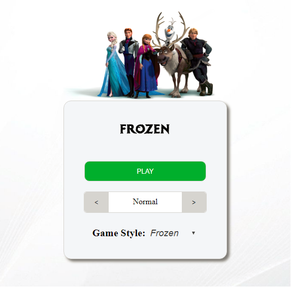

# Memory Game

My own javascript game with desktop and phone support.  
Your goal is to match a card to its right sibling. When all cards are turned up and correct you win. If you turn up two cards and they dont match they will turn back and you have to remember what it was for your next move.   
Should be easy to add your own content if wanted as long as you have some JS knowledge. Using some Jquery in code.  
For more info about modifying check the file "modifyGame.md".  

### Browser support:
- Chrome
- Firefox
- Microsoft Edge
- Opera
- (Safari? Im working on windows so cant test..)
- (Internet Explorer, not yet but working on it)

## Start guide:

### For local play:
1. Download game by pressing "clone and download".

2. Open up "index.html" and no need to modify anything.

### For implement on your site:
1. Download zip or clone.

2. Option 1, Iframe the "index.html" file on your site.

2. Option 2, Open "index.html" in your code editor and take everything inside the "body" tags and but it inside a "div" tag on your site. Then make sure to inluce all css/stylesheets.

## Play guide:

1. Select difficult (Easy - Normal - Hard).
> Number of cards.

2. Select "game style" / what deck you want to use.
> You choose from 4 different, for example Frozen.

3. Then just press "Play" and enjoy!

## License: 
Free for private use. For other idées please contact me first and talk about it.
